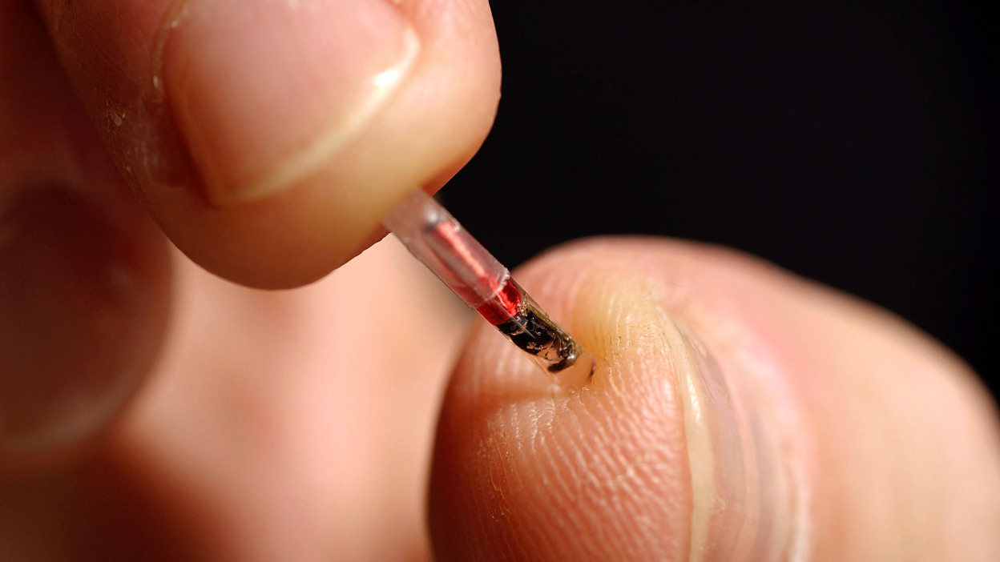

<h1 align="center">Ethical Concerns of RFID Tag Implants in Humans Report</h1>

  

  

  

  

While learning about Professional Skills in Computing and Engineering I had a project with a team of six people. Our team was tasked with performing a group case study to increase our awareness of the issues and dilemmas surrounding professional topics. Our topic of choice was RFID tag implants in humans and the ethical concerns corresponding to that.

---

# Table of Contents
- [What I Learned in this Project](#what-i-learned-in-this-project)
- [Tools Used in this Project](#tools-used-in-this-project)
- [Development Environment](#development-environment)
- [Team / Contributors / Teachers](#team--contributors--teachers)
- [Report Overview](#report-overview)
  - [Introduction](#introduction)
  - [Case Summary](#case-summary)
  - [Ethical Analysis](#ethical-analysis)
  - [Recommendations](#recommendations)
  - [Presentation](#presentation)
- [References](#references)
- [Acknowledgments](#acknowledgments)

---

# What I Learned in this Project
- How to use Asana in a team project effectively.
- The ability to recognize ethical and professional responsibilities in engineering and computing situations and make informed judgments based on legal and ethical principles and with consideration of global, economic, environmental, and societal impacts.
- Writing a research/results style paper in the IEEE format.

# Tools Used in this Project
- Google Docs (Draft)
- Microsoft Word (Final Draft)
- Microsoft PowerPoint (Presentation)
- Asana (Task Planning)
- Windows 10

# Team / Contributors / Teachers
- [Mitchell Kolb](https://github.com/mitchellkolb)
- Wyatt Croucher (Captain)
- Drayer Sivertsen
- Trevor Naze
- Ethan Burchett
- Yingqiang Yuan
- Professor Shira Broschat

# Report Overview
This report discusses the ethical concerns surrounding the use of RFID tag implants in humans. Our team explored the potential uses of these implants, such as tracking missing persons, acting as a payment method, and accessing medical information. We addressed the major ethical concerns and proposed scenarios where the risks associated with these devices could be minimized. Our analysis focused on three key ethical theories: Social Contract Theory, Rule Deontology, and Utilitarianism.

## Report Details

### Introduction
In this report, we delve into the evolving technology of RFID tag implants in humans. RFID, or Radio Frequency Identification Device, has been widely used in various industries for inventory tracking and supply chain visibility. Recently, there has been a shift towards implanting these devices in humans for applications such as medical information retrieval and personal identification. Given the invasive nature of these implants, our study highlights the ethical implications using established ethical theories.

### Case Summary
Our case study examined the potential ethical ramifications of RFID technology, particularly its application in human implants. We focused on the voluntary implementation of these devices in a free society, excluding scenarios where governments might mandate their use. We discussed the benefits, such as enhanced security and convenience, and the significant risks, including privacy breaches and unauthorized surveillance. The summary provided a comprehensive overview of RFID technology and its potential impact on society.

### Ethical Analysis
We utilized three ethical theories to analyze the ethical concerns of RFID tag implants:

**Social Contract Theory:** Companies must adhere to international and domestic laws regarding user data protection. We evaluated the ethics of RFID implants through the lens of social contracts, emphasizing the importance of privacy and compliance with regulations like GDPR and HIPAA.

**Rule Deontology:** This duty-based ethical theory focuses on the obligations individuals and companies have towards each other. We examined how RFID implants could violate personal rights if misused and proposed guidelines to ensure ethical adherence.

**Utilitarianism:** We analyzed the implants' potential to maximize benefits for the majority while minimizing harm. We discussed measures to secure data and prevent misuse, ensuring that the technology serves the greater good.

### Recommendations
Our recommendations focused on implementing stringent security measures to protect user data. We proposed the use of encryption and authentication protocols to prevent unauthorized access. Additionally, we recommended establishing legal frameworks to safeguard user privacy and restrict data misuse by corporations and governments.

### Presentation
Our team presented the findings of our report, highlighting the ethical concerns and proposed solutions for RFID tag implants in humans. The presentation emphasized the importance of balancing technological advancement with ethical considerations to protect individual rights.

## References
1. S. R. Bradley Munn, K. Michael, and M. Michael, "The social phenomenon of body-modifying in a world of technological change: past, present, future," 2016 IEEE Conference on Norbert Wiener in the 21st Century (21CW), 2016, pp. 1-6, doi: 10.1109/NORBERT.2016.7547463.
2. K. Michael, "Go 'Get Chipped?': A Brief Overview of Non-Medical Implants between 1997-2013 (Part 1)," in IEEE Technology and Society Magazine, vol. 36, no. 3, pp. 6-9, Sept. 2017, doi: 10.1109/MTS.2017.2742238.
3. K. Michael and M. G. Michael, "The diffusion of RFID implants for access control and epayments: A case study on Baja Beach Club in Barcelona," 2010 IEEE International Symposium on Technology and Society, 2010, pp. 242-252, doi: 10.1109/ISTAS.2010.5514631.
4. Gotterbarn, Don, et al. "Software Engineering Code of Ethics." Association for Computing Machinery Committee on Professional Ethics, Nov. 1997, ethics.acm.org/code-of-ethics/software-engineering-code/. Accessed 29 Apr. 2022.
5. Wolford, Ben. “What Is GDPR, the EU’s New Data Protection Law?” General Data Protection Regulation (GDPR) Compliance Guidelines, GDPR.EU, 7 Nov. 2018, gdpr.eu/what-is-gdpr/. Accessed 29 Apr. 2022.
6. Centers for Disease Control and Prevention. “Health Insurance Portability and Accountability Act of 1996 (HIPAA).” Centers for Disease Control and Prevention, 14 Sept. 2018, www.cdc.gov/phlp/publications/topic/hipaa.html. Accessed 29 Apr. 2022.
7. Halamka, John et al. “The security implications of VeriChip cloning.” Journal of the American Medical Informatics Association: JAMIA vol. 13,6 (2006): 601-7. doi:10.1197/jamia.M2143.
8. Zhanel Tucker and Chutima Boonthum-Denecke. “Security, privacy, and ethical concerns on human radio-frequency identification (RFID) implants: poster.” In Proceedings of the 12th Conference on Security and Privacy in Wireless and Mobile Networks (WiSec '19). Association for Computing Machinery, New York, NY, USA, 2019. 322–323.
9. UKEssays. (November 2018). Differences Between Deontology And Act Utilitarianism Philosophy Essay. Retrieved from https://www.ukessays.com/essays/philosophy/differences-between-deontology-and-act-utilitarianism-philosophy-essay.php?vref=1.
10. Tech Spirited (September 2019). RFID Chips in Humans. Informational Website. Retrieved from https://techspirited.com/rfid-chip-in-humans.
11. Driver, Julia. “The History of Utilitarianism.” Stanford Encyclopedia of Philosophy, Stanford University, 22 Sept. 2014, https://plato.stanford.edu/entries/utilitarianism-history/.
12. The Privacy Act of 1974 5 U.S.C. § 552a, the United States Department of Justice https://www.govinfo.gov/content/pkg/USCODE-2018-title5/pdf/USCODE-2018-title5-partI-chap5-subchapII-sec552a.pdf.
13. Greenleaf, Graham. "Global Tables of Data Privacy Laws and Bills (7th Ed, January 2021)." (2021) 169 Privacy Laws & Business International Report. 6-19, Available at SSRN: https://ssrn.com/abstract=3836261 or http://dx.doi.org/10.2139/ssrn.3836261.

--- 
# Acknowledgments
This report and all supporting materials was made as apart of a course for my undergrad at WSU for CPTS 302 - Professional Skills in Computing and Engineering in the Spring of 2022. 